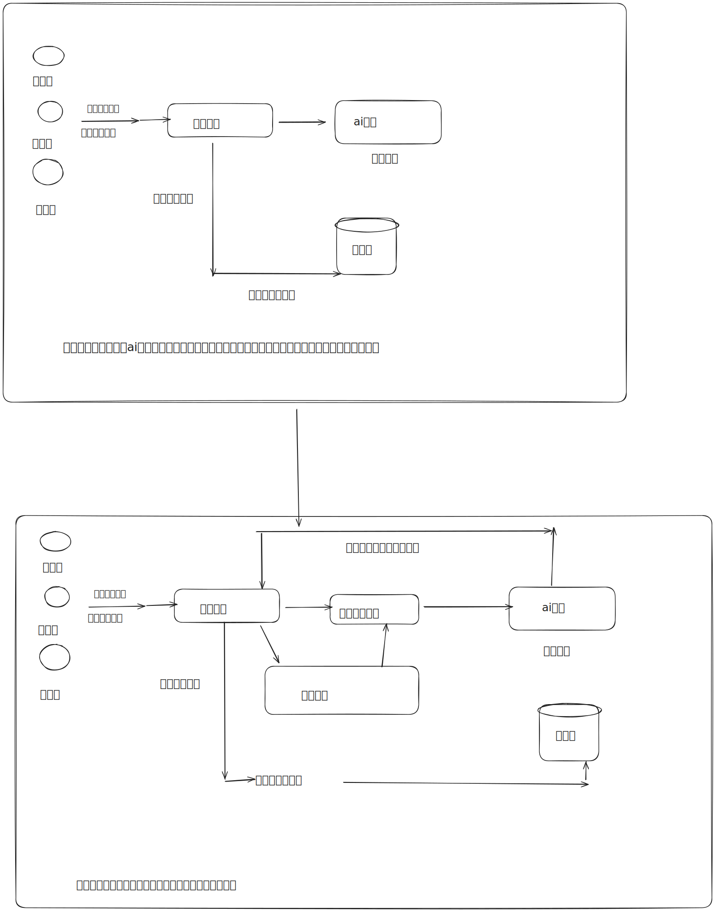

# 一个智能bi项目

## 项目背景

传统bi项目

- 需要人工上传数据
- 需要人工托选分析用的数据行和列
- 需要人工选择图标类型
- 生成图表保存配置

智能bi项目
1.用户只需要导入原始数据集
2.用户输入想要分析的目标
3.使用ai分析并生成符合要求的图表及结论
让不会数据分析的同学也能通过输入目标快速完成数据分析，大幅节约人力成本。

## 需求分析

1. 智能分析：用户输入目标和原始数据（图表类型），可以自动生成图表和分析结论
2. 图表管理
3. 图表生成的异步化（消息队列）
4. 对接 AI 能力

## 架构图

## 技术选型
前端
1. react
2. umi+ant design pro
3. 可视化开发库 echarts+highcharts+antv
4.  umi openapi 代码生成 后端调用代码

后端
1. spring boot
2. mysql 数据库
3. 消息队列 rabbitmq
4. mybatis-plus 数据库操作框架
5. ai能力  调用openai接口
6. excel上传和数据处理解析 easy excel
7.  swagger+knife4j 接口文档
8.  HuTool 工具类库

